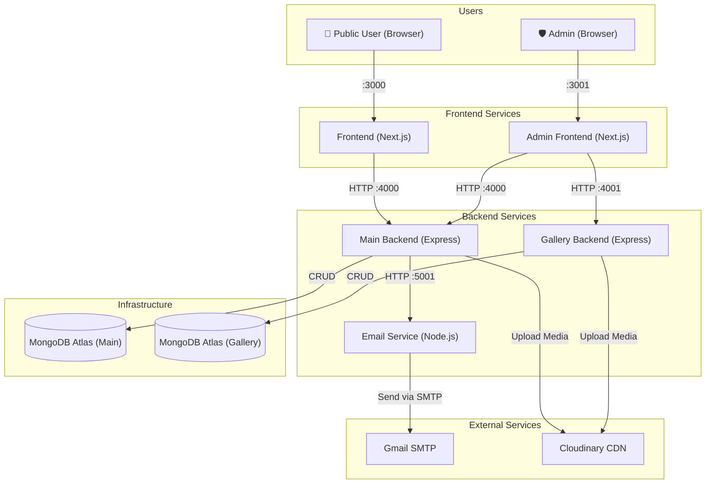
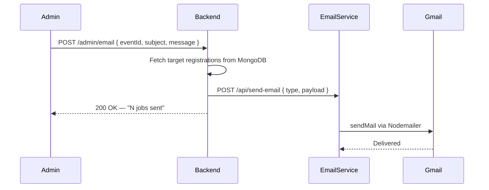
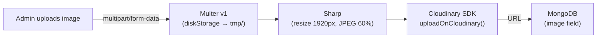
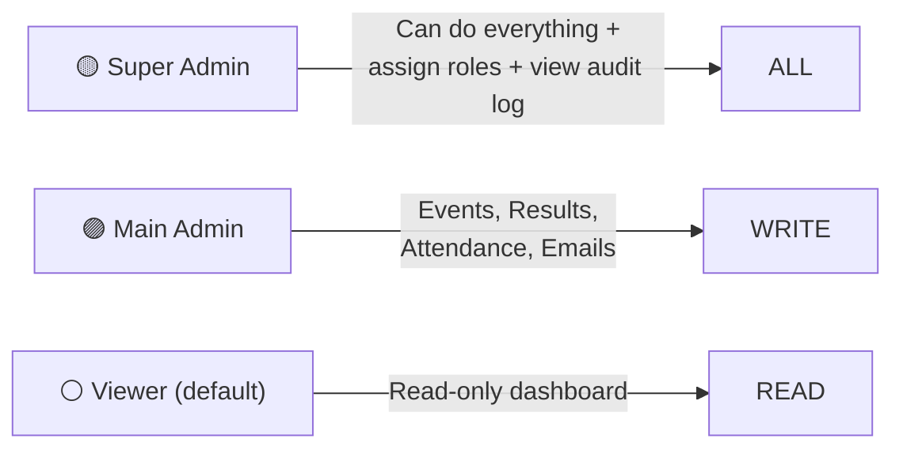

# FAROUCHE 2026 — BMSET HOSTEL Annual Fest

A dynamic, full-stack platform designed to streamline large-scale event participation and management.  
Successfully deployed for **2,000+ participants** across **45+ events**, ensuring high performance and scalability.  

---

## 🏗️ System Design & Architecture

FAROUCHE is a **multi-service web application** with a public-facing frontend, a separate admin dashboard, and independent backend services communicating over HTTP.

### High-Level Architecture


```mermaid
graph TD
    %% Clients
    subgraph Clients ["Users"]
        U["👤 Public User (Browser)"]
        A["🛡️ Admin (Browser)"]
    end

    %% Frontend Layer
    subgraph Frontends ["Frontend Services"]
        FE["Frontend (Next.js)"]
        AF["Admin Frontend (Next.js)"]
    end

    %% Backend Layer
    subgraph Backends ["Backend Services"]
        BE["Main Backend (Express)"]
        GB["Gallery Backend (Express)"]
        ES["Email Service (Node.js)"]
    end

    %% Infrastructure & DBs
    subgraph Infra ["Infrastructure"]

        DB1[("MongoDB Atlas (Main)")]
        DB2[("MongoDB Atlas (Gallery)")]
    end

    %% Third-Party Services
    subgraph External ["External Services"]
        GM["Gmail SMTP"]
        CL["Cloudinary CDN"]
    end

    %% Routing & Connections
    U -->|":3000"| FE
    A -->|":3001"| AF

    FE -->|"HTTP :4000"| BE
    AF -->|"HTTP :4000"| BE
    AF -->|"HTTP :4001"| GB

    BE -->|"HTTP :5001"| ES

    BE -->|"CRUD"| DB1
    GB -->|"CRUD"| DB2

    ES -->|"Send via SMTP"| GM
    BE -->|"Upload Media"| CL
    GB -->|"Upload Media"| CL
```

### Services Overview

| # | Service | Port | Tech | Purpose |
|---|---|---|---|---|
| 1 | `frontend` | 3000 | Next.js 14 | Public website — events, registrations, gallery, results |
| 2 | `adminfrontend` | 3001 | Next.js 14 | Admin dashboard — CRUD, attendance, emails, roles |
| 3 | `backend` | 4000 | Express + Node | Main API — auth, events, registrations, results, admin management |
| 4 | `gallerybackend` | 4001 | Express + Node | Gallery API — image upload, compress, store |
| 5 | `email-service` | 5001 | Node.js + Express | HTTP email microservice — sends emails via Gmail SMTP |

### Email Flow (HTTP)


```mermaid
sequenceDiagram
    participant Admin
    participant Backend
    participant EmailService
    participant Gmail

    Admin->>Backend: POST /admin/email { eventId, subject, message }
    Backend->>Backend: Fetch target registrations from MongoDB
    Backend->>EmailService: POST /api/send-email { type, payload }
    Backend-->>Admin: 200 OK — "N jobs sent"
    EmailService->>Gmail: sendMail via Nodemailer
    Gmail-->>EmailService: Delivered
```

**Job types:**
- `registration_confirm`: Triggered when a user registers for an event.
- `admin_bulk`: Triggered when an admin sends a custom email from the dashboard.

### Image Upload Pipeline


```mermaid
graph LR
    A["Admin uploads image"] -->|multipart/form-data| M["Multer v1\n(diskStorage → tmp/)"]
    M --> S["Sharp\n(resize 1920px, JPEG 60%)"]
    S --> C["Cloudinary SDK\nuploadOnCloudinary()"]
    C -->|URL| DB["MongoDB\n(image field)"]
```
*(Note: Gallery backend uses Sharp compression, Main backend uploads directly to Cloudinary)*

---

## 🔒 Role-Based Access Control (RBAC)


```mermaid
graph LR
    SA["🟡 Super Admin"]
    MA["🟣 Main Admin"]
    VA["⚪ Viewer (default)"]

    SA -->|"Can do everything +\nassign roles + view audit log"| ALL
    MA -->|"Events, Results,\nAttendance, Emails"| WRITE
    VA -->|"Read-only dashboard"| READ
```

| Permission | Viewer | Admin | Super Admin |
|---|:---:|:---:|:---:|
| View events, registrations, results | ✅ | ✅ | ✅ |
| Add / Edit / Delete events & results | ❌ | ✅ | ✅ |
| Mark attendance & Send bulk email | ❌ | ✅ | ✅ |
| Admin management & Audit log | ❌ | ❌ | ✅ |

---

## 🚀 Key Features & Highlights

- **Full-Stack Development & Deployment**  
  Led the end-to-end development of a robust platform, deployed on **DigitalOcean** and **AWS** with scalable infrastructure.  

- **Real-Time Dashboards**  
  Integrated **Google Sheets API** for instant updates and analytics of registrations, results, and event status.  

- **Efficient Media Handling**  
  Used **Cloudinary** for fast, reliable, and optimized image & media management.  

- **Asynchronous Email Delivery**  
  Implemented an **HTTP-based email microservice** with Gmail SMTP, handling high email volume reliably (reduced email failures by 80%).  

---

## 🛠️ Tech Stack

- **Frontend:** Next.js 14, TailwindCSS, Framer Motion
- **Backend:** Node.js, Express.js
- **Database:** MongoDB Atlas, Mongoose
- **Email:** Nodemailer, Gmail SMTP
- **Media:** Cloudinary, Multer, Sharp
- **Integration:** Google Sheets API, Nodemailer
- **Deployment:** DigitalOcean, AWS, Docker

---

## 💻 Local Development Setup

### Startup Order

```bash
# Terminal 1 — Email Service (Port 5001)
cd email-service
npm run dev

# Terminal 2 — Main Backend (Port 4000)
cd backend
npm run dev

# Terminal 3 — Gallery Backend (Port 4001)
cd gallerybackend
npm run dev

# Terminal 4 — Public Frontend (Port 3000)
cd frontend
npm run dev

# Terminal 5 — Admin Frontend (Port 3001)
cd adminfrontend
npm run dev
```

### Environment Variables Required
- `MONGO_URI` (MongoDB Atlas)
- `JWT_SECRET` & `ADMIN_SECRET_KEY` (Backend Auth)
- `CLOUDINARY_CLOUD_NAME`, `CLOUDINARY_API_KEY`, `CLOUDINARY_API_SECRET`
- `EMAIL_SERVICE_URL` (Default: `http://localhost:5001/api/send-email`)
- `EMAIL_USER` & `EMAIL_PASS` (Gmail App Password)

---

## 🤝 Contributing

Contributions and feature requests are welcome. Please open an issue or submit a pull request.
